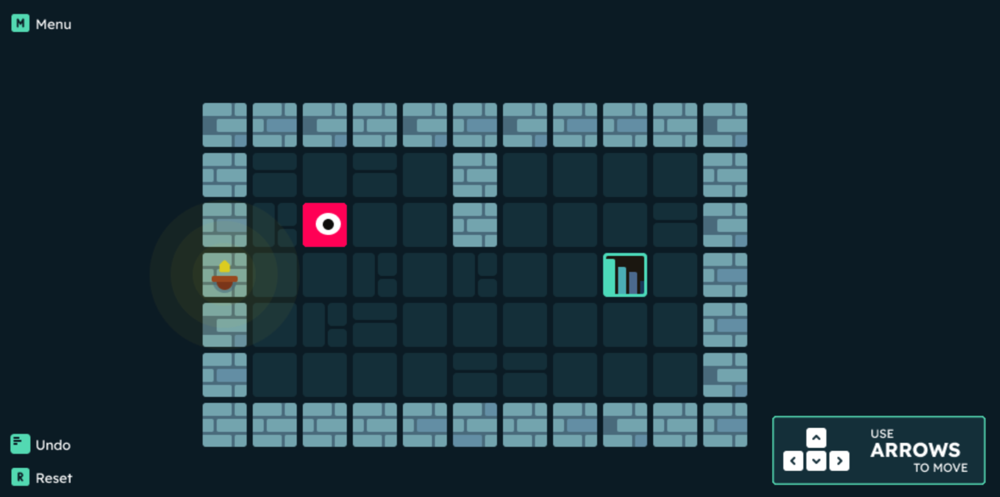
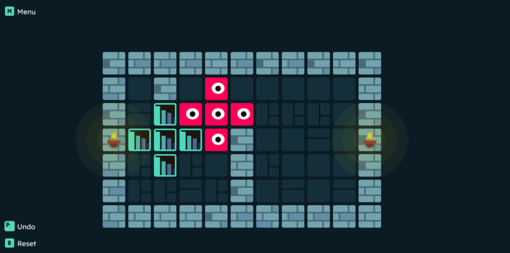
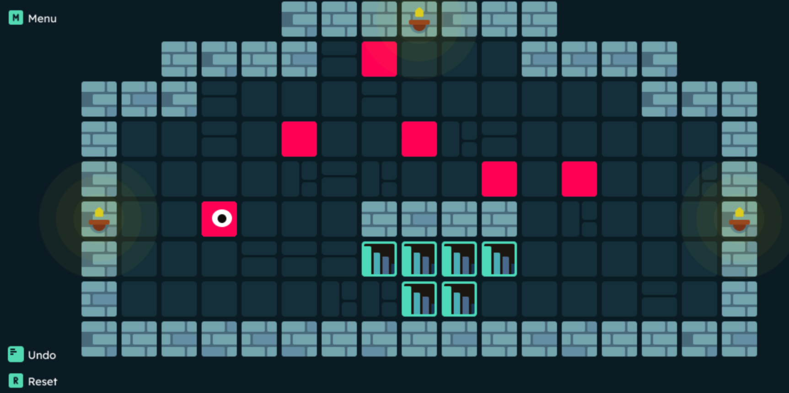
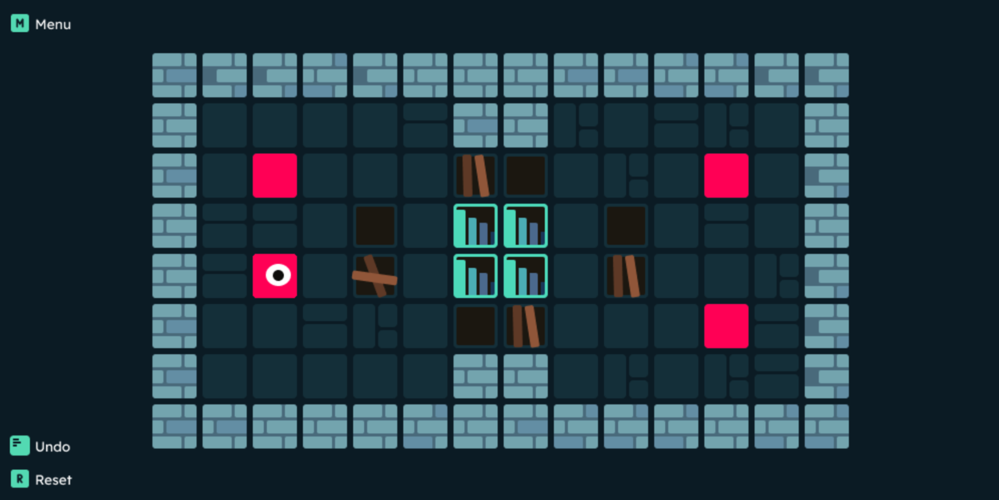

# UTN - Facultad Regional Buenos Aires - Materia Paradigmas de Programación

[¡Jugar ahora!](https://www.wollok.org/concurso/2024-o-tpjuego-bestiasalgoritmicas/)

## Introducción

<h3 style = "font-weight:bolder">
¡Preparate para un quilombo de bloques en STICKY BLOCK!
</h3>

Acá no solo tenés que mover los bloques, ¡sino que cuando se pegan, te armás un lío bárbaro! 😜
Usá la cabeza para juntar los bloques mientras buscás la manera de llegar a la meta. 🧠

¿Te animás a resolver este embrollo o te quedás pegado? 🧩 **¡Dale que va! 🚀**

## Capturas

## Reglas de Juego / Instrucciones

### Instrucciones de *Sticky Block*

1. **Uní los bloques**: ¡Mové los *stickyblocks* y hacelos pegarse entre sí! Cuanto más pegajosos, mejor. 💥

2. **Esquivá los agujeros**: ⚠️Cuidado⚠️ En algunos niveles, ¡el piso tiene trampas! 🕳️

3. **Formá la figura**: Tenés que llegar a la meta, pero ojo, ¡la forma importa! Acomodalos como en el objetivo. 🎯

¡Dale que podés! 🚀

## Controles:

R para reiniciar el nivel

M para abrir el menú

## Ganador del Concurso Wollok Game 2024

El concurso Wollok Game 2024 reunió a estudiantes de universidades como la Universidad Nacional de Quilmes, la Universidad Tecnológica Nacional y la Universidad Nacional de Hurlingham para presentar sus juegos desarrollados en Wollok.

Organizado por Uqbar, los juegos fueron evaluados tanto por sus características técnicas como por la creatividad de sus desarrolladores. Nos complace anunciar que **Sticky Blocks** ha sido premiado como el juego ganador de esta edición.

### Diploma 

## Equipo de desarrollo:

- Devecchi Di Bella Lucas Nahuel
- Diez Forradellas Facundo
- Hernandez Mateo Nicolas
- Osa Pochelu Valentin Rodrigo
- Serrudo Jose Luis

## Algunos conceptos Teóricos aplicados:

[Conceptos teóricos aplicados en el TP](ConceptosTeoricos.md)
